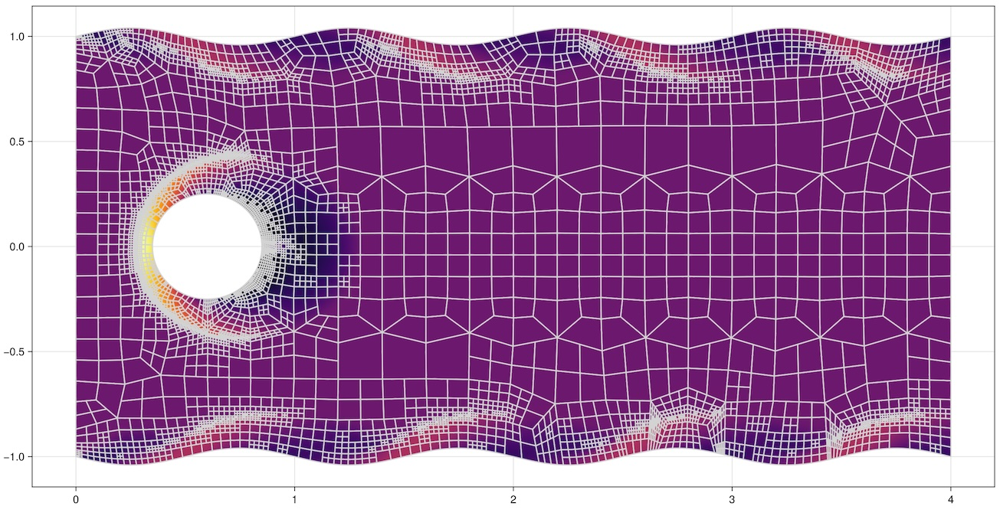

# New trends and developments in DGSEM: Robustness, efficiency, and application

[](https://opensource.org/licenses/MIT)

This is the companion repository for the talk

**New trends and developments in DGSEM: Robustness, efficiency, and application**  
[*Michael Schlottke-Lakemper*](https://lakemper.eu), [*Gregor Gassner*](https://www.mi.uni-koeln.de/NumSim/)  
DLR Institute of Aerodynamics and Flow Technology, Braunschweig, Germany, 18th March 2024

## Reproducibility

To reproduce the live demo of [Trixi.jl](https://github.com/trixi-framework/Trixi.jl)
shown in the talk, perform the following steps:

### Install Julia
Go to https://julialang.org/downloads and download the latest stable version of Julia (this
repository was created with Julia v1.10.2).

### Get reproducibility repository
Clone this reproducibility repository by executing
```shell
git clone https://github.com/sloede/talk-2024-dlr-braunschweig-repro.git
```

### Start Julia and run code
Go to the cloned repository and start the Julia REPL with
```shell
julia --project=examples
```

If you have not done it in a previous session, you need to install all required packages by running
the following code in the REPL (only needed once):
```julia
using Pkg
Pkg.instantiate()
```

To generate the mesh, execute the following code in the REPL:
```julia
include("examples/generate_mesh_cylinder_with_sine_walls.jl")
```
Since the mesh file is saved in the `out` folder (together with other simulation results), this is
usually required only once as well.

To run the simulation, execute the following code in the REPL:
```julia
include("examples/elixir_euler_mach2_cylinder.jl")
```
Note that if you want to quickly run the simulation with some of its parameters modified, you can do
so using Trixi.jl's
[`trixi_include`](https://trixi-framework.github.io/Trixi.jl/v0.7.3/reference-trixibase/#TrixiBase.trixi_include-Tuple%7BModule,%20AbstractString%7D)
function. For example, to run the simulation to and end time of $T_\text{end} = 0.5$, you can
execute the following code:
```julia
using Trixi
trixi_include("examples/elixir_euler_mach2_cylinder.jl", tspan=(0.0, 0.5))
```

Finally, if you want to quickly visualize the results, execute the following code in the REPL:
```julia
using GLMakie
pd = PlotData2D(sol)
plot(pd["rho"])
```
This will create a plot similar to the following:
[](result.jpg)

For more visualization options, including the ability to visualize the results with
[ParaView](https://www.paraview.org/), please refer to the
[Trixi.jl documentation](https://trixi-framework.github.io/Trixi.jl/stable/visualization/).

## Authors
This repository was initiated by
[Michael Schlottke-Lakemper](https://lakemper.eu) and
[Gregor Gassner](https://www.mi.uni-koeln.de/NumSim/).

The Julia scripts in the [`examples`](examples) folder were adapted from the
[JuliaCon 2022 talk](https://github.com/trixi-framework/talk-2022-juliacon_toolchain) by
[Andrew R. Winters](https://liu.se/en/employee/andwi94).
We are very grateful for the opportunity to reuse these elixirs :pray:!


## License
The contents of this repository are licensed under the MIT license (see [LICENSE.md](LICENSE.md)).
